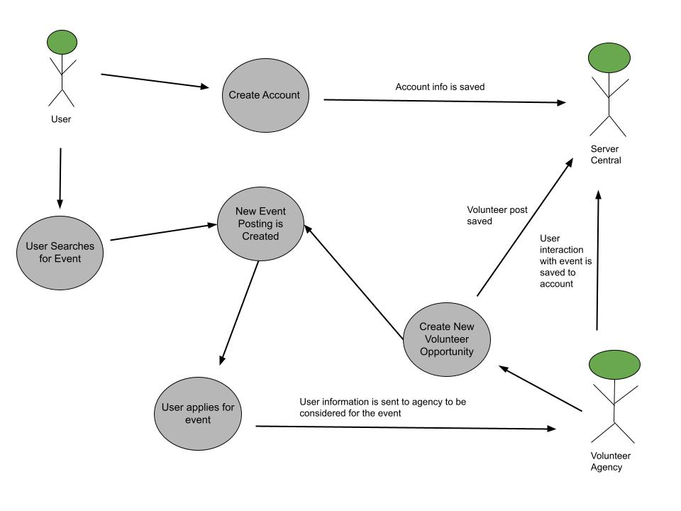
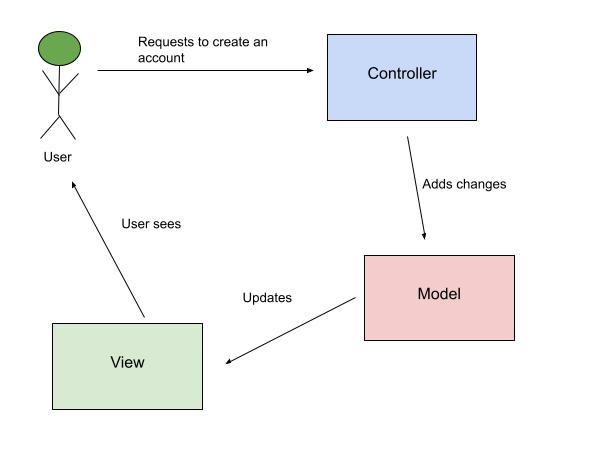

# Lab Report: Continuous Integration
___
**Course:** CIS 411, Spring 2021  
**Instructor(s):** [Trevor Bunch](https://github.com/trevordbunch)  
**Name:** Grace Schlauder  
**GitHub Handle:** grace-schl  
**Repository:** [My Forked Repository](https://github.com/grace-schl/cis411_lab2_arch)  
**Collaborators:** @MichaelMourelatos @andrewcoldsmith
___

# Step 1: Confirm Lab Setup
- [X] I have forked the repository and created my lab report
- [X] I have reviewed the [lecture / discsussion](../assets/04p1_SolutionArchitectures.pdf) on architecture patterns.
- [X] If I'm collaborating on this project, I have included their handles on the report and confirm that my report is informed, but not copied from my collaborators.

# Step 2: Analyze the Proposal
Serve Central is an application that allows for users to have all volunteering information in their area at the tip of thier fingers. Companies can post about different volunteering oppotunities they are offering and then users can register if interested. 

## Step 2.1 Representative Use Cases  

| Use Case #1 | |
|---|---|
| Title | Volunteer Posting |
| Description | A representitive for a company posts any volunteer opportunities that are currently available. |
| Steps | 1. Representitive logs into the company's account |
| | 2. Representative selects to create a new volunteer listing |
| | 3. System provides a template for filling in the needed information (such as description of volunteer work, experience needed, hours of service, company contact infromation, etc.) |
| | 4. Representitive selects that the listing is completed once all information has been imput | 
| | 5. The listing is posted to the company's account |
| | 6. A notification is sent out to any users who have turned on notification requests |
| Primary Actor | The company representative |
| Preconditions | 1. The representative is authorized to log into an account that |
| | 2. The account is validated as being associated with said company |
| Postconditions | 1. The listing is posted to the company's account |
| | 2. A notification is sent out to any users who have set up notification requests |

| Use Case #2 | |
|---|---|
| Title | User Application |
| Description | A user applying for their preferred volunteer opportunity. |
| Steps | 1. User logs into their account |
| | 2.  User navigates to the preferred volunteer opportunity listing|
| | 3. User selects the opption to apply for opportunity ("Apply" button) |
| | 4. User is directed to a page with prompts to fill out all of the information that the company needs about the user|
| | 5.  User submits their application for volunteer opportunity|
| | 6. Application is sent to company |
| | 7.  User recieves an email or text that confirms that their application has been completed |
| Primary Actor | The user recieves either an email or text that informs them that their application has successfully been completed|
| Preconditions | The user is logged into an account that has been verified through email or phone number|
| Postconditions | 1. The user's application has been sent to the company |
| | 2. The user recieves an email or text that confirms that their application has been completed |

## Step 2.2 Define the MVC Components

| Model | View | Controller |
|---|---|---|
| Name | Organization Page | OrganizationFeedController |
| Location | Volunteer Page | VolunteerFeedController |
| Event Title | Event Feed | EventFeedController |
| Event Description | Description Page | EventDescriptionsController |

## Step 2.3 Diagram a Use Case in Architectural Terms

# Step 3: Enhancing an Architecture

## Step 3.1 Architecture Change Proposal
INSERT Architectural change proposal here, and how it meets the two new requirements.  Explain both the benefits and draw backs of your proposal.

## Step 3.2 Revised Architecture Diagram
INSERT IMAGE HERE with a Description.

# Step 4: Scaling an Architecture
INSERT Architectural change proposal here, and how it meets the four new requirements.  Explain both the benefits and draw backs of your proposal.  If the changes are significant, then you need to explain why the changes are necessary versus a nice-to-have enhancement.

# Extra Credit
If you opt to do extra credit, then include it here.